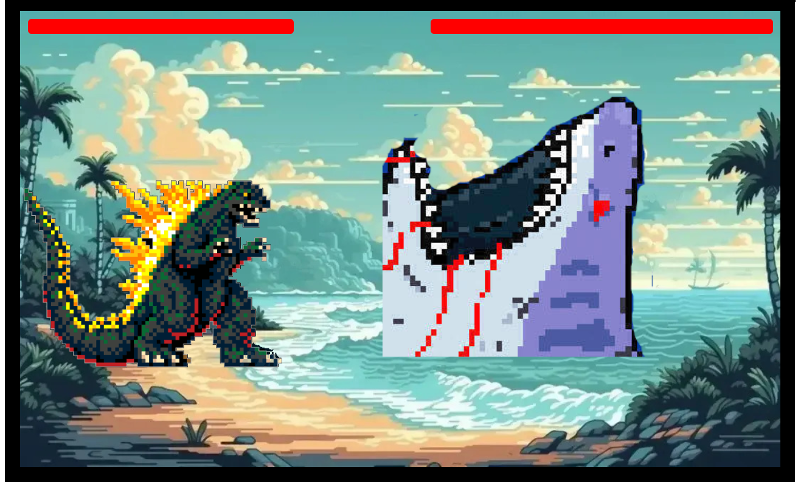

# Gojira vs. Megalodon!

## How to play:
- DEFEAT Megalodon by taking its health before it takes yours!
    - Use the keys:
    - 'A' for attack
    - 'S' for block
    - 'Spacebar' for jump
    - ',' for left 
    - '.' for right
 - It's a "Street Fighter" inspired game where monsters battle for surival. I picked this style bacause I wanted to be creative with characters I enjoy inside a classic arcade fighting game. It's a concept I found exciting and that helped fuel me to want to see a final project amongst all the frustration.    

## Links 
- The game: https://gojiravsmegalodon.netlify.app/
- For More Planning Info:  https://github.com/RobertAFranco/GojiraFight/blob/main/Assets/GameProposal.md

## Attributions: 
 - Chat GPT helped me with character animations, in which I used keyframes. The block function. Getting Megalodon AI attacks at a set intervals and for attacks to effect the health bars. It also helped me refine movement issues and character blocking and staying in the arena.

## Technologies used: 
- JavaScript, HTML, CSS.

## Next steps: 
- Add more monsters for Gojira to fight with higher difficulty.
- Add new arenas and elements (falling debris/environmental hazards that cause damage)
- Add special attacks/combos.
- Add higher quality animations and fighting gameplay.
- Make it mutiplayer.

